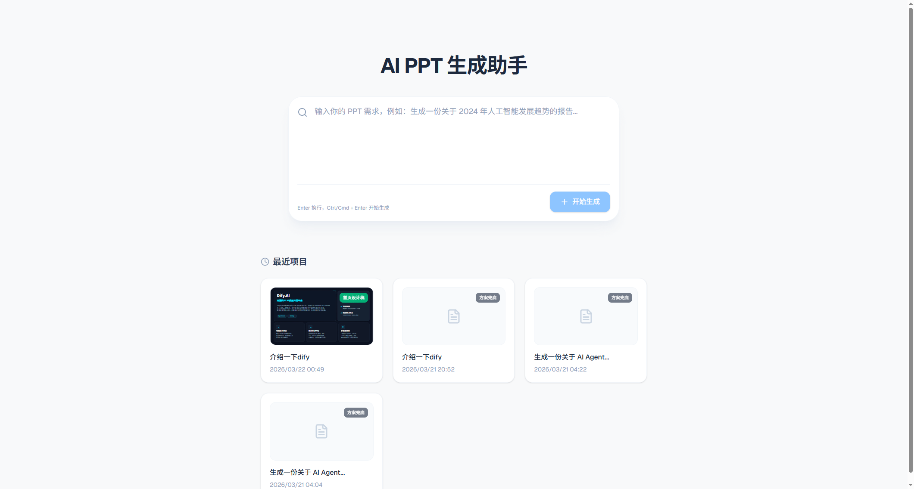
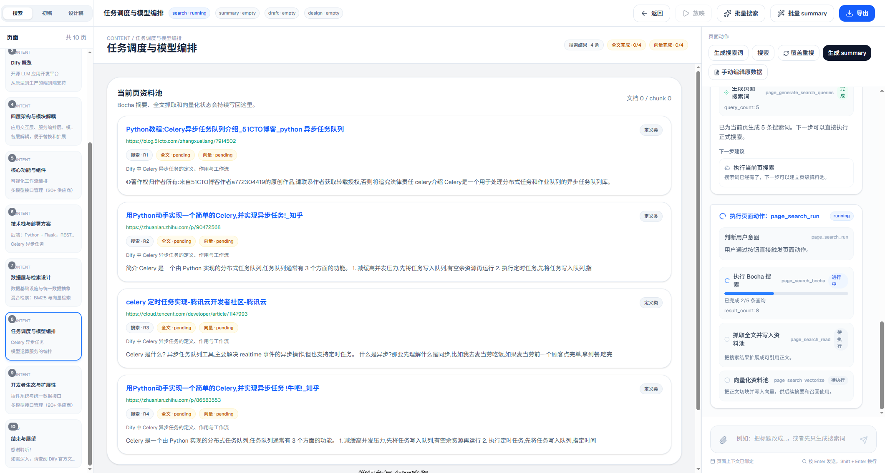
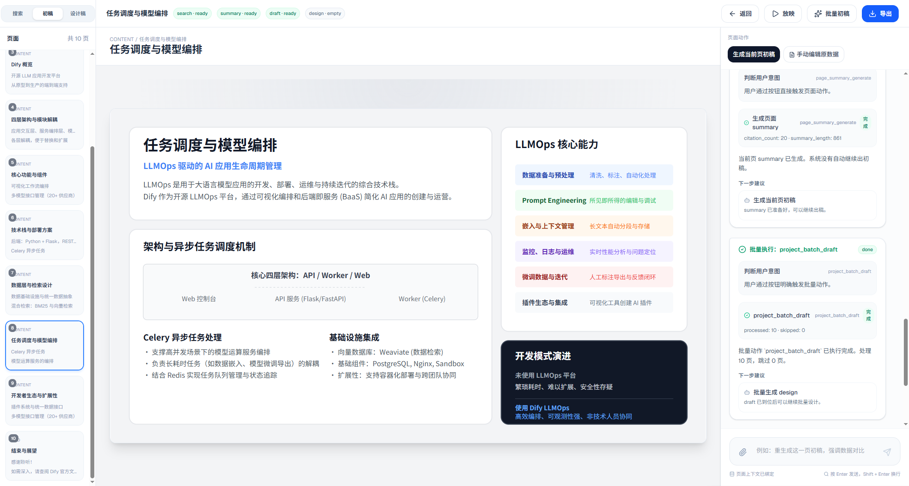
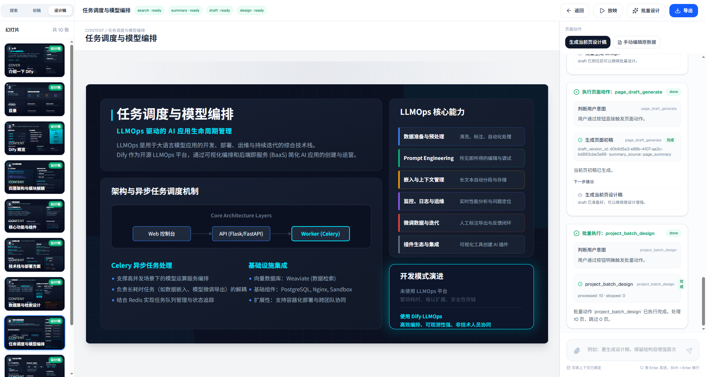
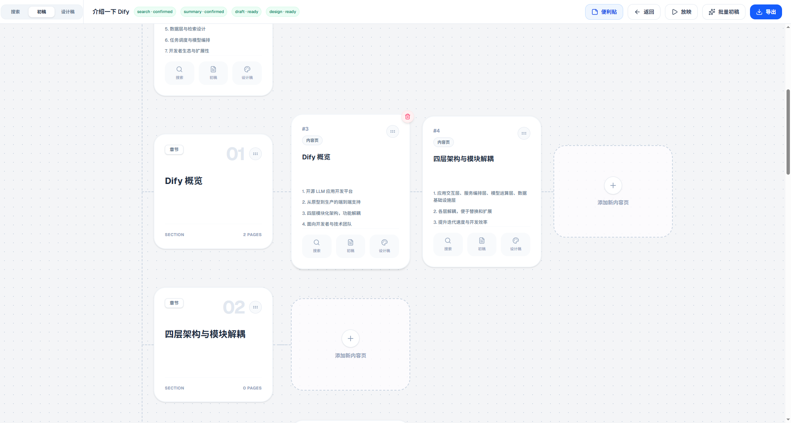
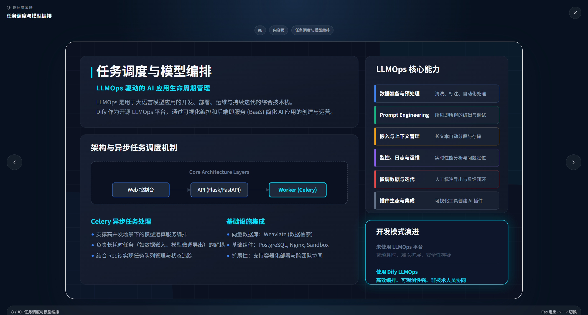
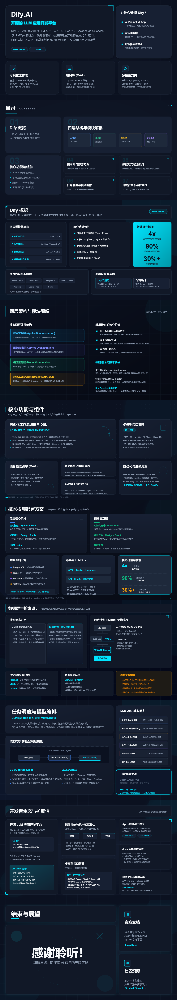

# PPT Agent

PPT Agent 是一个面向 AI PPT 生成的工作台项目。它不是简单把一段提示词丢给模型然后吐出几页 SVG，而是把项目初始化、资料搜索、页级研究、初稿生成、设计稿生成和 PPTX 导出串成一条可观察、可干预、可回放的 agent workflow。

通过联网搜索（bocha） + 向量化产出 SVG 完成整个PPT的产出，可以通过新版本 PPT 进行转换成形状进行编辑。 

当前仓库包含两部分：

- `src/`：React + Vite 前端工作台
- `backend/`：FastAPI 后端，负责项目状态、页级流程、事件流和导出

项目为纯 Vibe Coding，发生了一些需求偏移，例如：AI Agent工作方式，智能推断和mcp，但是保证可以勉强使用

## 最近更新

### 2026-04-13：导入 PPT 后生成 Summary 报错修复

**问题**：导入 PPT 项目后，点击"生成 summary"时报错 `RuntimeError: 当前页资料池为空，不能生成 summary`

**原因**：导入项目和普通搜索项目共用了同一条 `page_summary_generate` 逻辑，但导入项目不会自动建立 `page_corpus_digest`，导致空资料池校验失败

**修复**：
- 新增 `_is_imported_project()` 判断函数，区分导入项目与普通项目
- 修改 `_run_page_summary()` 逻辑：导入项目无资料池时，直接使用当前页标题和要点重建 summary
- 修复后导入页可正常重生成 summary，并将 draft/design 标记为 `stale`

**详细记录**：[summary报错修复记录.md](summary报错修复记录.md)

### 2026-04-13：启动排查与优化

- 完善项目启动流程文档
- 发现并定位 `ORJSONResponse` 弃用告警（不影响运行，后续可清理）
- 确认 `logs/*.pid` 为历史残留文件，不影响服务启动

**详细记录**：[启动与排查记录.md](启动与排查记录.md)

## 核心能力

- 项目初始化：根据用户需求生成首轮搜索结果、需求单、页数建议、风格预设和补充问题。
- 导入已有 PPTX：可以直接导入现成 `.pptx`，生成页面结构、summary 和基础 SVG 预览后继续编辑。
- 大纲生成：初始化确认后进入锁定的大纲生成阶段，完成后直接切到搜索工作台。
- 页级搜索工作台：每一页独立维护搜索词、资料池、summary、状态流转，不把别页资料混进来。
- 初稿与设计稿：基于当前页 summary 生成 draft SVG，再结合风格预设和可选背景资源生成 design SVG。
- Agent 过程可视化：前端通过 SSE 实时展示 router 决策、执行步骤、状态变化和下一步建议。
- PPTX 导出：设计稿确认后可以直接导出 `.pptx` 文件。

## 工作流

1. 创建项目，输入原始 PPT 需求。
2. 系统做初始化搜索，建立 `init_corpus`，生成需求单与补充问题。
3. 用户确认页数、风格和问题答案后，后端生成大纲与页面实体。
4. 在搜索工作台逐页生成搜索词、搜索资料、整理 summary。
5. 基于页级 summary 生成初稿 SVG。
6. 基于 draft SVG 和风格包生成设计稿 SVG。
7. 导出 PPTX。

## 界面预览

### 首页



### 搜索工作台



### 初稿页



### 设计稿页



### 便利贴结构视图



### 放映模式



## 技术栈

- 前端：React 19、TypeScript、Vite 6、Tailwind CSS 4
- 后端：FastAPI、SQLAlchemy、Pydantic Settings、SSE、python-pptx
- 模型与检索：OpenAI 兼容接口、Embedding、Bocha/Jina/MCP 检索链路
- 存储：PostgreSQL + pgvector 为推荐方案；也支持 SQLite 本地启动

## 目录结构

```text
ppt/
├─ src/                 前端工作台
├─ backend/             FastAPI 后端服务
├─ docs/                设计文档与界面截图
├─ static/              旧版静态 POC，可作为 UI 参考
├─ storage/             上传资源、背景图、导出文件
├─ .env.example         环境变量示例
└─ README.md
```

## 快速开始

### 1. 准备环境

- Node.js 20+
- Python 3.11+
- 推荐：PostgreSQL 15+、`pgvector`
- 可选：Redis

如果你只是本地快速跑通，可以直接用 SQLite；如果要跑完整向量检索链路，建议使用 PostgreSQL。

### 2. 配置环境变量

仓库根目录使用统一的 `.env`。首次启动可以先复制模板：

```powershell
Copy-Item .env.example .env
```

最关键的配置项有这些：

- `DATABASE_URL`：数据库连接串。最简本地模式可改成 `sqlite:///./backend/data/ppt_agent.db`
- `CONTEXT_LLM_API_KEY`：文本模型 API Key
- `SVG_LLM_API_KEY`：SVG 生成模型 API Key
- `EMBEDDING_API_KEY`：向量模型 API Key
- `MCP_BOCHA_URL` / `MCP_BOCHA_AUTH_HEADER`：Bocha 检索服务
- `MCP_JINA_URL` / `MCP_JINA_AUTH_HEADER`：Jina 检索服务

### 3. 安装依赖

前端：

```powershell
npm install
```

后端：

```powershell
python -m venv .venv
.venv\Scripts\python.exe -m pip install -e backend
```

### 4. 启动后端

```powershell
$env:PYTHONPATH="backend"
.venv\Scripts\python.exe -m uvicorn app.main:app --host 0.0.0.0 --port 8000
```

后端默认接口前缀是 `/api/v1`，并会自动创建 `storage` 下的上传、背景和导出目录。

### 5. 启动前端

```powershell
npm run dev
```

默认情况下，Vite 会把 `/api` 和 `/storage` 代理到 `http://127.0.0.1:8000`。如果你把后端部署到别的地址，可以设置：

```powershell
$env:VITE_API_PROXY_TARGET="http://your-backend-host:8000"
```

启动后访问前端开发地址即可开始创建项目。

## 导入已有 PPTX

首页新增了 `导入 PPTX` 入口。上传现有 `.pptx` 后，系统会：

- 解析每页文本和图片
- 生成项目页面、基础大纲和页面 summary
- 为每页生成一个可在工作台中继续编辑的基础 SVG 预览

当前导入是“最小可用版本”：

- 支持继续编辑标题、要点、summary，并可继续重生成 draft / design
- 支持直接导出为新的 `.pptx`
- 不保证完整保留原 PowerPoint 的所有 shape、动画、母版、图表和精细样式

当前版本进一步增强了两点：

- 导入时会额外尝试还原更多基础形状和样式，包括背景色、表格、部分分组内容、更多自选图形、线条、文字颜色、字号和对齐方式
- 对导入项目提供 `兼容导出`，优先复用原始 `.pptx` 页面；未改动页面保持原页，改动页面会以当前设计稿覆盖到对应原页上

`兼容导出` 的适用范围：

- 适合导入后按原页顺序继续修改和导出
- 如果你删除、重排或在中间插入原有页面，系统会自动回退到普通导出模式
- 前端会明确提示当前是“保留原页”还是“将回退到普通导出”

## 开发说明

- 项目当前前端工作台位于 `src/`，`static/` 是旧版 POC，只适合作为 UI 参考，不是主入口。
- 后端任务默认通过本地后台线程异步执行，前端通过 SSE 接收事件流并刷新状态。
- 如果你需要先理解业务边界，不要直接猜，先看 [docs/README.md](docs/README.md)。
- 如果你只关心后端接口与链路，先看 [backend/README.md](backend/README.md)。

## 文档索引

- [docs/README.md](docs/README.md)：整体文档入口
- [docs/final-target-agent-workflow.md](docs/final-target-agent-workflow.md)：目标工作流与约束
- [docs/08-backend-technical-roadmap.md](docs/08-backend-technical-roadmap.md)：后端技术路线
- [backend/README.md](backend/README.md)：当前后端接口与主链路说明

## 🙏 致谢

感谢 [linuxdo](https://linux.do) 社区的交流、分享与反馈，让 PPT Agent 的迭代更高效。

感谢[Sandun佬友](https://linux.do/t/topic/1782304)开源的思路和提示词

前端设计原稿为帖内分享的截图进行整理和归纳，更好的原始项目体验可以前往佬友的商业化项目： [SANDUN - PPT Design Agent](https://sandun.cc)

## License

本项目基于 Apache-2.0 License 开源，详见 [LICENSE](LICENSE)。


## 成品示例

下面这份示例成品展示了 PPT Agent 的最终导出效果，主题是“介绍一下 Dify”。无人工做任何调整跑完一次流程的产物。

模型使用：gpt-5-nano + gemini-3-flash-preview

- PPTX 原文件：[docs/images/介绍一下dify.pptx](docs/images/介绍一下dify.pptx)



如果你想直接评估导出质量、排版密度和页面组织，不用先启动整套链路，直接打开这份 `.pptx` 原文件就够了。
